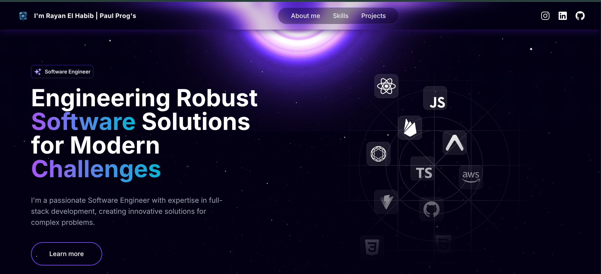

<a name="readme-top"></a>

# 🚀 Rayan El Habib - Software Engineer Portfolio



[](https://github.com/rayanelhabib/Portfolio-React-design-/blob/main/LICENSE)
[](https://nextjs.org/)
[](https://www.typescriptlang.org/)
[](https://tailwindcss.com/)


## 👨‍💻 About Me

I'm a passionate Software Engineer with expertise in full-stack development, creating innovative solutions for complex problems. I specialize in building modern web applications, Discord bots, and interactive experiences using cutting-edge technologies.

## ✨ Features

- 🌌 **Modern Space Theme** - Futuristic design with animated backgrounds
- 📱 **Responsive Design** - Optimized for all devices
- ⚡ **Fast Performance** - Built with Next.js 14 and optimized for speed
- 🎨 **Interactive Animations** - Smooth transitions with Framer Motion
- 🎵 **Discord Bot Development** - Showcasing my bot projects
- 🔧 **Full-Stack Skills** - Frontend and backend expertise

## 🛠️ Tech Stack

[](https://react.dev/)
[](https://nextjs.org/)
[](https://www.typescriptlang.org/)
[](https://tailwindcss.com/)
[](https://threejs.org/)
[](https://nodejs.org/)
[](https://javascript.info/)
[](https://git-scm.com/)

## 🚀 Getting Started

### Prerequisites

- Node.js 18+ 
- npm or yarn

### Installation

1. Clone the repository
```bash
git clone https://github.com/rayanelhabib/Portfolio-React-design-.git
cd Portfolio-React-design-
```

2. Install dependencies
```bash
npm install
# or
yarn install
```

3. Run the development server
```bash
npm run dev
# or
yarn dev
```

4. Open [http://localhost:3000](http://localhost:3000) in your browser

## 📁 Project Structure

```
Portfolio-React-design-/
├── app/                    # Next.js app directory
├── components/             # React components
│   ├── main/              # Main components
│   └── sub/               # Sub components
├── constants/             # Configuration and data
├── lib/                   # Utility functions
├── public/                # Static assets
│   ├── projects/          # Project images
│   ├── skills/            # Skill icons
│   └── videos/            # Background videos
└── config/                # App configuration
```

## 🎯 Featured Projects

- **🤖 BOT-One-tap-discord** - Powerful Discord bot with advanced features
- **🎵 BotMusicDiscord** - Music bot for Discord servers
- **🐦 Flappy-Bird-Java-Swing** - Classic game recreated in Java

## 📱 Screenshots


## 🔗 Connect With Me

[](https://www.instagram.com/skz_rayan23)
[](https://www.linkedin.com/in/rayan-el-habib/)
[](https://github.com/rayanelhabib)

## 📄 License

This project is licensed under the MIT License - see the [LICENSE](LICENSE) file for details.

## 🙏 Acknowledgments

- [Next.js](https://nextjs.org/) - The React framework for production
- [Framer Motion](https://www.framer.com/motion/) - Animation library
- [Three.js](https://threejs.org/) - 3D graphics library
- [Tailwind CSS](https://tailwindcss.com/) - Utility-first CSS framework
- [Heroicons](https://heroicons.com/) - Beautiful hand-crafted SVG icons

## ⭐ Star History

[](https://star-history.com/#rayanelhabib/Portfolio-React-design-&Date)

---

<p align="center">
  Made with ❤️ by <a href="https://github.com/rayanelhabib">Rayan El Habib</a>
</p>

<p align="right">(<a href="#readme-top">back to top</a>)</p>
